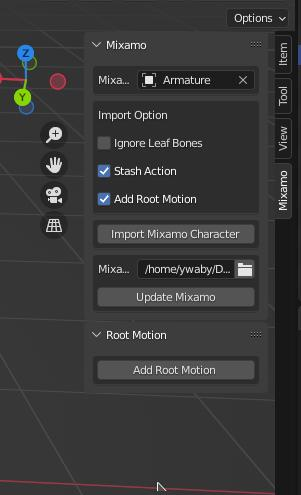

This is a blender addon for import and update mixamo animations (*.fbx).  

License under MIT.

## feature
- scale to 1, apply rotation
- merge animation
- rename bone and action
- add action to NLA
- add root motion

## install
git clone this repository to blender addon dir.

or download [zip](https://github.com/ywaby/mixamo2bl/archive/refs/heads/master.zip) then install in blender
```
preferences->addons->install
```

enable addon 
```
preferences->addons->search "Mixamo Import"
```

## usage
3D View > UI (Right Panel) > Mixamo Tab  




workflow
1. download mixamo animation with skin.
2. import mixamo character 
3. download mixamo animations without skin to a folder.
4. select download folder
5. update

<!-- 
## TODO
- json preset for rename bone 
- add NLA option if need
- unit test
- add github sponars
- add control rig shape
- conect bone and set roll =0 then recalc animation

BUG
 -->

## isuse
#### why not connect bone when import
keep bone `roll=0` for mirror animation work.

### not support dae
as mixamo'dae has a lot problem.
- without skin will lose origin bone pose
- origin position not right
- bone roll not same with fbx 
- etc.